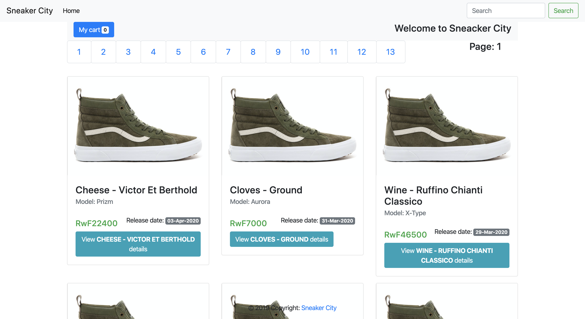

# Backlog for Sneaker City - FRONTEND

Sneaker City is a brand new online-only store for sneaker enthusiasts.

# Home page



## Technologies

- Runtime environment: [Node](https://nodejs.org/)
- Frontenf framework: [React/Redux](https://github.com/facebook/create-react-app)

## Installation

Before installing, [download and install Node.js](https://nodejs.org/en/download/).

## Features

- View latest sneakers
- View availability of sneaker size
- Add sneaker to cart
- Review cart and checkout
- Finishing shopping

## Quick Start

The quickest way to setup Sneaker app is as shown below:

```
git clone git@github.com:AJAkimana/sneaker-city-ui.git
cd sneaker-city-ui
```

Install dependencies:

```bash
$ npm install
```

Start the server:
Runs the app in the development mode.<br />
Open [http://localhost:3000](http://localhost:3000) to view it in the browser.

```bash
$ npm run start
```

Run local tests:

```bash
$ npm run test
```

## The current maintainer:

[Akimana Jean D'Amour](https://github.com/AJAkimana)
